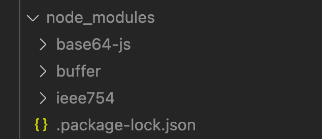
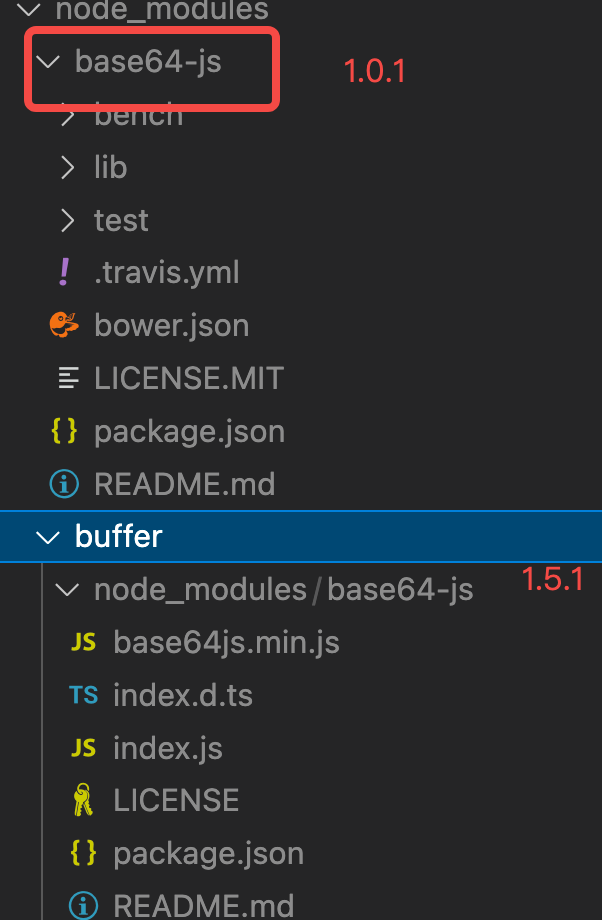

## npm 包管理

### npm 早期 - 嵌套结构

早期的 npm（v2）版本，就是单纯的依赖下载，安装依赖时只是按依赖关系递归然后放到各自的 node_modulers 中。如 A 依赖 B、C，B 依赖 D，C 也依赖 D，那就会形成如下图所示依赖关系。这种架构的弊端是一个项目很大时，依赖的层级太深，冗余的依赖越多。

```
A --->  B ---> D
        |
        C ---> D
```

### 扁平结构

npm v3.x 版本改成了扁平结构。

-   安装模块时，不管是直接依赖还是子依赖，都优先安装在 node_modules 的`根目录`。

```
"dependencies": {
    "buffer": "^5.0.0",
},
```

`buffer`依赖`base64-js`，npm 会把依赖都扁平化的放在`node_modules`中，如图


- 安装到相同模块时，如新增`"base64-js": "1.0.1"`，这时npm会判断已安装的依赖是否匹配新模块的版本范围，如果匹配，就不安装新模块，否则在当前模块（指buffer）的下面的`node_modules`中新增依赖。
当前因为本来最外层`node_modules`有`base64-js`的1.5.1版本，而他是`buffer`的依赖，所以新增的`1.0.1版本`的会到最外层，而`1.5.1版本`会放到`buffer`下面。
```
 "dependencies": {
        "buffer": "^6.0.3",
        "base64-js": "1.0.1"
    },
```


- 当我们要查找一个模块依赖，先查找当前模块下是否存在，然后递归向上查找，直到找到最外层

### package-lock.json
上面扁平结构有一个弊端，如`buffer`引用了某一个版本的`base64-js`，然后`buffer2`引用了另外一个版本的`base64-js`，这时候`package.json`里的`buffer/buffer2`的引用顺序就会引起包依赖的不同，会对不同使用者不友好。
所以`webpack5.x`版本新增了`package-lock.json`文件，用来缓存依赖的模块结构。
在`webpack5.4.2`版本后，会有如下场景：
- 若项目中没有`package-lock.json`，执行`npm install`会生成`package-lock.json`
- 当项目中同时存在`package-lock.json`和`package.json`
  - 如果`package.json`的`[semver-range]（语义化版本）`匹配`package-lock.json`的版本，会忽略`package.json`的版本，直接去`package-lock.json`中下载对应版本
  - 如果两边版本不匹配，则去`package.json`中下载对应的版本，并更新`package-lock.json`中对应模块版本
- 如果项目中同时存在`package-lock.json`和`npm-shrinkwrap.json`，则忽略`package-lock.json`

### 缓存
`npm config get cache`获取缓存目录


